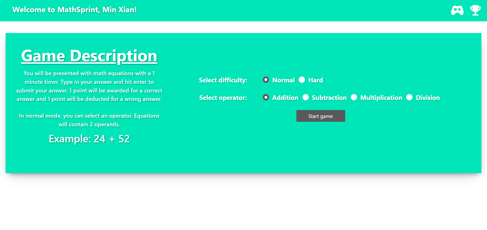
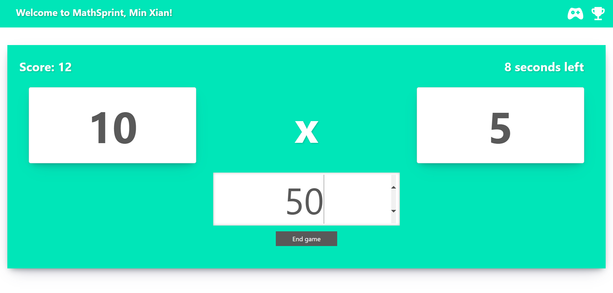

# MathSprint
This is an application to practice basic math equations involving the 4 fundamental operators (+, -, *, /). Normal mode provides users the ability to practice specific operators while hard mode provides more experienced users the chance to test their skills. A leaderboard of top 10 scores of each category allows users to compete as they brush up their skills. The application can be found [here](http://18.139.221.150:8050/).

## Setup
To set up the application locally, Docker is required. Run the following commands and the application can be found on your [localhost](http://127.0.0.1:8050).
```sh
docker build -t mathsprint .
docker run -p 8050:8050 mathsprint
```

## Screenshots

Landing page of application.


Start game allows user to select different settings.


Example of a game.


Leaderboard and statistics of a category (histogram will look better with more entries).
